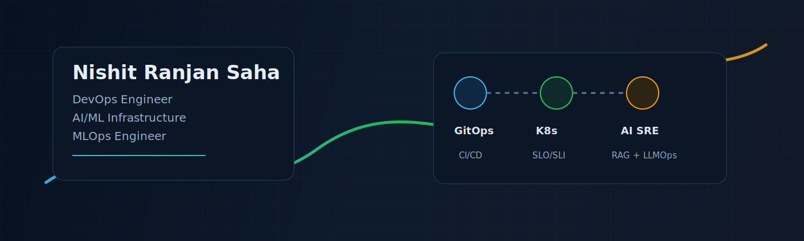
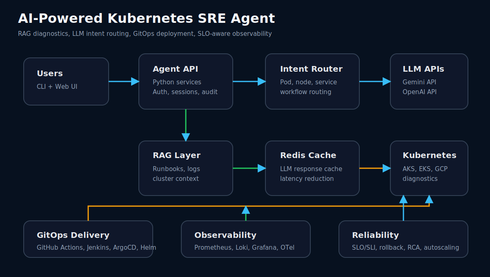
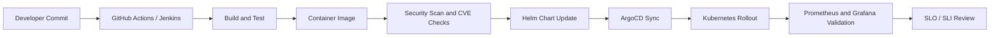
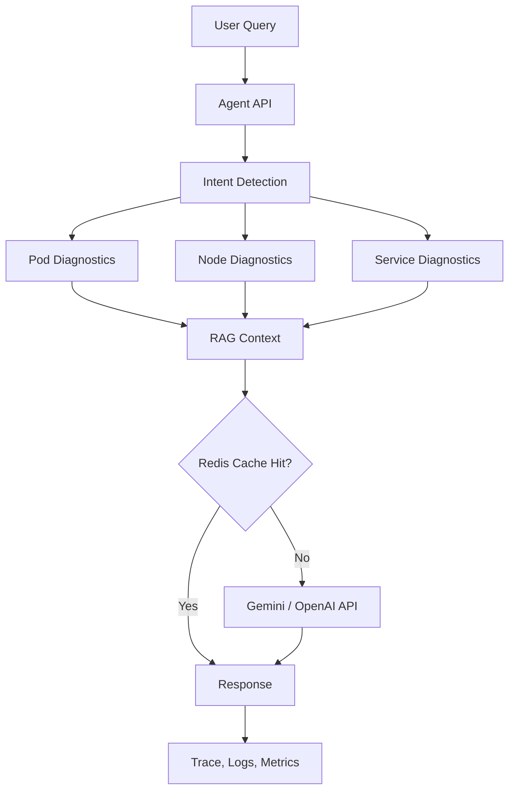
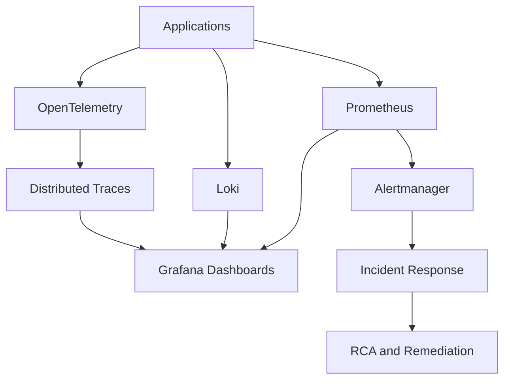
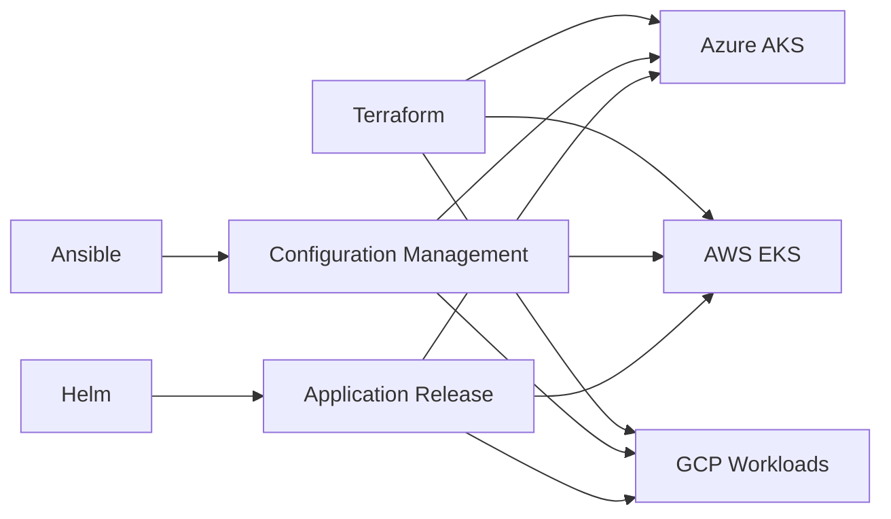
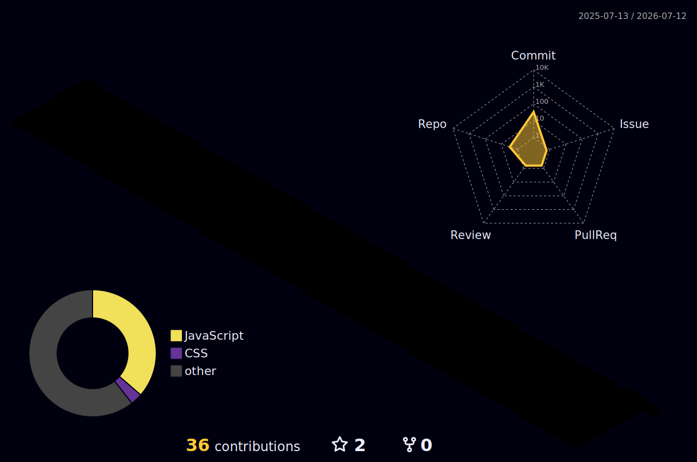

<div align="center">
  
</div>

<h1 align="center">Hi, I am Nishit Ranjan Saha</h1>

<p align="center">
  <a href="https://git.io/typing-svg">
    
  </a>
</p>

<p align="center">
  <a href="mailto:nishitsaha62@gmail.com"></a>
  <a href="https://www.linkedin.com/in/nishit-saha-8208151b9"></a>
  <a href="https://github.com/nishitsaha52"></a>
  
</p>

<p align="center">
  
  
  
  
</p>

---

## About Me

I am a DevOps Engineer and AI/ML Infrastructure specialist with production experience across Kubernetes, Docker, CI/CD, GitOps, Infrastructure as Code, and observability. I work on the intersection of platform engineering, SRE, and MLOps: deploying reliable cloud-native systems, automating delivery pipelines, and making AI-powered tools production ready.

My recent work includes operating workloads across AKS, EKS, and GCP, building SLO-aware observability with Prometheus, Grafana, Loki, Alertmanager, and OpenTelemetry, and deploying AI/LLM systems such as a Kubernetes SRE Agent using RAG, Gemini API, OpenAI API, Redis caching, and GitOps.

```yaml
name: Nishit Ranjan Saha
role: DevOps Engineer | AI/ML Infrastructure | MLOps Engineer
company: TCG Digital
location: Kolkata, India
experience:
  - Product Developer, TCG Digital
  - Consultant, TCG Digital
strengths:
  - Kubernetes production operations
  - CI/CD and GitOps automation
  - MLOps and LLM-powered infrastructure tooling
  - Observability, SLOs, incident response, RCA
  - Infrastructure as Code and secure deployments
```

---

## Engineering Snapshot

| Area | What I Build |
|---|---|
| Platform Engineering | Repeatable Kubernetes deployments, Helm releases, GitOps workflows, Terraform and Ansible automation |
| SRE and Observability | SLO/SLI tracking, MTTD/MTTR reduction, Prometheus, Grafana, Loki, Alertmanager, OpenTelemetry |
| AI Infrastructure | RAG pipelines, LLM integrations, agent orchestration, Redis-backed inference optimization |
| Cloud Operations | AKS, EKS, GCP workloads, IAM, VPC, routing, autoscaling, production rollouts |
| Security | HashiCorp Vault, MinIO KES, CVE remediation, container image hardening, release compliance |
| Automation | Jenkins, GitHub Actions, Jira workflow automation, one-click deployment workflows |

---

## Tech Stack

### Cloud


### DevOps, Containers, and GitOps


### Infrastructure as Code


### Observability and SRE


### AI, LLM, and MLOps


### Security and Compliance


### Languages, Frameworks, and Data


---

## Professional Experience

### TCG Digital - Product Developer

`June 2025 - Present | Kolkata, India`

- Deployed and operated software across 10+ client environments on AKS, EKS, and GCP using Kubernetes, Docker, Helm, and Terraform.
- Maintained 99.9% uptime with SLA/SLO-compliant production operations.
- Architected the VorteX Observability Platform using Prometheus, Loki, Grafana, Alertmanager, and OpenTelemetry.
- Reduced MTTD by 40% with proactive monitoring, alerting, dashboards, and incident visibility.
- Designed Jenkins and GitHub Actions CI/CD pipelines with GitOps workflows using ArgoCD.
- Cut pipeline configuration time by 60% and standardized deployments across client environments.
- Implemented Ansible playbooks and Helm charts for repeatable one-click deployments of VorteX and Vault-KES.
- Reduced setup time from hours to minutes through Infrastructure as Code automation.
- Integrated HashiCorp Vault, MinIO, and KES for enterprise-grade secrets management.
- Hardened container images, performed CVE remediation, and supported release compliance.
- Managed 3 concurrent production environments with Kubernetes rolling deployments and autoscaling.
- Automated Jira reporting with Python, saving 5+ hours weekly and improving scrum velocity by 20%.

### TCG Digital - Consultant

`December 2024 - June 2025 | Kolkata, India`

- Applied Docker, Kubernetes, Ansible, Linux, Python, Elasticsearch, and MySQL across enterprise client environments.
- Achieved 98% SLA compliance through systematic incident prioritization and queue management.
- Reduced average ticket resolution time by 20% with structured RCA documentation.
- Implemented Terraform and Ansible provisioning across 5+ client environments.
- Improved deployment efficiency by 25% and reduced configuration drift.
- Delivered GitOps deployment workflows adopted across multiple client engagements.
- Expanded Java and JavaScript delivery capability within 3 months of onboarding.

---

## Featured Projects

<table>
  <tr>
    <td width="50%">
      <h3>Kubernetes SRE Agent</h3>
      <p><strong>AI-powered Kubernetes diagnostics platform</strong></p>
      <p>Production-deployed AI/LLM SRE agent using RAG, Gemini API, OpenAI API, Python, Redis, Kubernetes, GitOps, and SLO/SLI-aware workflows.</p>
      <p>
        
        
        
        
        
      </p>
      <ul>
        <li>Reduced manual debugging time by 50%.</li>
        <li>Implemented intent routing for pod, node, and service diagnostics.</li>
        <li>Cut redundant Gemini API calls by 35% with Redis caching.</li>
        <li>Deployed with HA Kubernetes, ArgoCD, rollback, and SLO/SLI compliance.</li>
      </ul>
    </td>
    <td width="50%">
      <h3>VorteX Observability Platform</h3>
      <p><strong>Production monitoring and incident visibility platform</strong></p>
      <p>End-to-end observability stack with metrics, logs, tracing, alerting, dashboards, and automated deployment across client environments.</p>
      <p>
        
        
        
        
        
      </p>
      <ul>
        <li>Enabled real-time metrics, distributed tracing, log aggregation, and alerting.</li>
        <li>Reduced MTTD by 40% across production environments.</li>
        <li>Automated repeatable rollout with Ansible and Helm.</li>
        <li>Supported proactive incident management and RCA workflows.</li>
      </ul>
    </td>
  </tr>
  <tr>
    <td width="50%">
      <h3>AI Chatbot</h3>
      <p><strong>Multimodal LLM application</strong></p>
      <p>React and Node.js application with OpenAI API, Google OAuth, image recognition, text-to-speech, speech-to-text, and GitHub Actions delivery.</p>
      <p>
        
        
        
        
      </p>
      <ul>
        <li>Increased engagement by 25% through multimodal AI interaction.</li>
        <li>Improved inference response time by 30%.</li>
        <li>Used asynchronous processing, request batching, and efficient API integration.</li>
      </ul>
    </td>
    <td width="50%">
      <h3>Smart Commute App</h3>
      <p><strong>Full-stack commute intelligence app</strong></p>
      <p>Real-time routing, weather, and AQI application using React.js, Node.js, Mapbox API, Google API, and Open Weather API.</p>
      <p>
        
        
        
        
      </p>
      <ul>
        <li>Improved route accuracy by 15%.</li>
        <li>Reduced third-party API response time by 20% using request batching.</li>
        <li>Combined commute, weather, and air quality intelligence into one workflow.</li>
      </ul>
    </td>
  </tr>
</table>

---

## Kubernetes AI SRE Architecture

<div align="center">
  
</div>

---

## Mermaid Architecture Library

### GitOps Delivery Flow



### AI Agent Workflow



### Observability Stack



### Multi-Cloud Workload Model



---

## GitHub Analytics

<div align="center">
  
  
</div>

<div align="center">
  
</div>

<div align="center">
  
</div>

<div align="center">
  
</div>

---

## Contribution Animations

<div align="center">
  
</div>

<div align="center">
  
</div>

---

## Certifications

| Certification | Issuer | Year |
|---|---:|---:|
| Microsoft Azure AI Fundamentals (AI-900) | Microsoft | 2023 |
| Microsoft Azure Fundamentals (AZ-900) | Microsoft | 2023 |
| Data Analytics Virtual Internship | Deloitte Australia | 2023 |
| Data Analytics Virtual Internship | KPMG AU | 2023 |
| Introduction to HTML5 | University of Michigan, Coursera | 2022 |

---

## Education

| Degree | Institute | Period |
|---|---|---:|
| Master of Computer Applications (MCA) | Techno International Newtown | 2022 - 2024 |
| Bachelor of Computer Applications (BCA) | Techno India Institute of Technology | 2019 - 2022 |

---

## Current Focus

- Building production-ready AI infrastructure on Kubernetes.
- Improving GitOps deployment reliability across multi-cloud environments.
- Designing observability stacks that reduce MTTD and support fast RCA.
- Optimizing LLM applications with caching, batching, intent routing, and SLO-aware design.
- Hardening containers, remediating CVEs, and improving release compliance.

---

## Operating Principles

```text
Automate repeatable work.
Make production behavior observable.
Design for rollback before release.
Treat reliability as a feature.
Bridge AI capability with platform discipline.
```

---

## Blog and Writing

> Add your blog links here when ready. Suggested topics based on your CV:

- Building a Kubernetes SRE Agent with RAG and LLM intent routing.
- Designing a Prometheus, Loki, Grafana, Alertmanager, and OpenTelemetry platform.
- GitOps release patterns with Jenkins, GitHub Actions, ArgoCD, and Helm.
- Redis caching strategies for reducing LLM API cost and latency.
- CVE remediation and container image hardening in CI/CD pipelines.

---

## Contact

<p align="center">
  <a href="mailto:nishitsaha62@gmail.com"></a>
  <a href="https://www.linkedin.com/in/nishit-saha-8208151b9"></a>
  <a href="https://github.com/nishitsaha52"></a>
</p>

---

<div align="center">
  
</div>

<h3 align="center">Thanks for visiting. Let us build platforms that make intelligent systems reliable.</h3>
